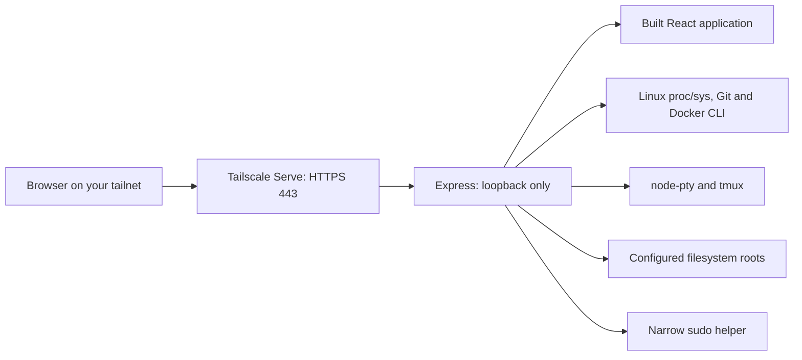

# Home Dev Control Center

**Your Linux development machine, from your phone.**

A private, mobile-first development cockpit for Linux. Monitor health, discover
running servers, manage projects and files, and reconnect to a real terminal
through Tailscale. It runs as your development user and keeps its backend on
loopback. Dark mode, touch-friendly controls, and persistent tmux sessions make
routine work practical from an iPhone.

## Features

- Live CPU, RAM, swap, disk, load, uptime, network and available temperature sensors.
- Configurable warning/critical thresholds; missing sensors remain unavailable.
- Development server discovery with PID, working directory, ports and resource use.
- Private app links, graceful Stop, confirmed Restart/Force Kill and process details.
- Git-aware project discovery, package scripts and configurable project commands.
- File tree, breadcrumbs, search, sorting, upload/download, CRUD, preview and editing.
- Real PTYs with xterm.js; persistent tmux sessions, multiple tabs and mobile shortcuts.
- Agent/process/session views, favorites and configurable one-tap command presets.
- Retained terminal/process logs, live refresh, search, pause and bounded history.
- Optional Docker container actions, logs, terminals and private exposed-port links.
- Confirmed reboot/shutdown through a narrow root-owned helper; administrative audit log.

## Screenshots

Screenshots will be added using synthetic projects and data. Screenshots from a
real development machine can reveal credentials, project names, paths and host
identifiers, so none are included in this release.

| View | Planned screenshot |
| --- | --- |
| Dashboard | Mobile health cards, active projects and quick actions |
| Terminal | iPhone terminal with shortcut bar and persistent tabs |
| Files | Touch file manager and code editor |

## Architecture



The backend serves production assets, SSE snapshots and WebSocket PTYs.
Development applications use separate authenticated loopback proxy gateways;
Tailscale Serve provides their HTTPS endpoints. Configuration and mutable data
live outside the checkout. See [architecture](docs/ARCHITECTURE.md).

## Security model

Access requires both an allowlisted Tailscale login and an independent random
access key. Backend authorization applies to APIs, live streams and terminals.
Host and Origin checks are strict; mutations require CSRF tokens. Sessions use
HttpOnly, Secure, SameSite=Strict cookies, expire after 12 hours, and are cleared
when the backend restarts. Login, mutation and power actions have rate limits.

The application has your user account's authority. **The terminal is a full shell,
not a sandbox.** File-browser roots do not restrict terminal commands. A user
with Docker socket access or unrestricted sudo can gain root through a terminal.
Only authorize trusted people who should control your development account.

The root helper accepts reboot, poweroff, and bounded loopback Serve exposure
arguments. There is no generic privileged command API. It must be root-owned,
with a separately validated sudoers rule. Tailnet access alone is not sufficient:
configure Tailscale ACLs/grants and keep the independent dashboard key private.
See [security boundaries and limitations](SECURITY.md).

## Requirements

- Linux with `/proc`, `/sys` and systemd user services; a regular development user.
- Node.js **22.12+** (Node 24 recommended), npm, Python 3, Git, tmux and iproute2 (`ss`).
- C/C++ compiler and make for native PTY dependencies, plus sudo for installation.
- Tailscale installed and connected; MagicDNS and tailnet HTTPS enabled.
- Bash; zsh is optional. Docker is optional and requires access to its daemon.
- Installation currently expects Python, systemctl and tailscale in `/usr/bin`.
  Check these paths before installing the privileged helper on another distribution.

Example Debian/Ubuntu prerequisites:

```bash
sudo apt update
sudo apt install git tmux python3 build-essential iproute2 sudo
```

Install a supported Node release and Tailscale using their official instructions.
The package manager/version is your choice; the service records the absolute
Node executable used during installation. Reinstall/update the unit if that
executable moves after a version-manager upgrade.

## Installation

All example identities and hostnames below are dummy values. Substitute your own.

```bash
git clone https://github.com/YOUR_ACCOUNT/home-dev-control-center.git
cd home-dev-control-center
./scripts/install.sh developer@example.com --root "$HOME/projects"
```

Run this as your development user. The installer checks requirements, installs
locked dependencies, rebuilds native modules, builds assets and notices, creates
private configuration, configures Serve, installs the root helper/sudoers rule,
and enables the user service and lingering. It prompts for sudo normally; your
account does not need general passwordless sudo. An existing installation is
refused rather than overwritten. No user environment/configuration is copied
from the original developer's machine.

The backend port defaults to 4310 and can be chosen during installation:

```bash
./scripts/install.sh developer@example.com --port 14321 --root "$HOME/projects"
```

This is an internal configurable port. Your dashboard URL uses HTTPS 443 and
has **no explicit port number**. Ensure your selected backend port is free.

## Tailscale and the clean HTTPS URL

Connect both your Linux machine and phone to your tailnet:

```bash
sudo tailscale up
tailscale status
```

Enable MagicDNS and HTTPS in the Tailscale admin console. Limit the machine's
access using ACLs/grants. The installer discovers the machine's DNS name locally
and creates a persistent Serve mapping equivalent to:

```bash
sudo tailscale serve --bg --https=443 --set-path=/ http://127.0.0.1:4310
```

Use your chosen internal port if different. This uses **Serve**, not public Funnel.
Background Serve resumes after device/tailscaled restarts. The backend remains
bound to `127.0.0.1`. Existing unrelated routes are preserved. If HTTPS `/` already
serves another application, setup stops before changing it. Review the mapping
and explicitly opt into replacement only if intended:

```bash
python3 scripts/configure-private-access.py --replace-existing
```

A private backup of the original Serve configuration is retained in the data
directory. After a hostname or backend-port change, rerun the setup script.
See [Tailscale Serve documentation](https://tailscale.com/docs/reference/tailscale-cli/serve).

On iPhone: open Tailscale, connect to the same tailnet, then open the printed
`https://machine.example.ts.net/` equivalent in Safari. Enter the dashboard access
key. The sample domain is illustrative. Use your machine's actual full tailnet
DNS name for its valid TLS certificate. Add the page to your home screen if useful.
Tagged Tailscale nodes may not send a user login identity and are not supported
as authenticated browser clients by the current login allowlist.

## Initial configuration

Defaults:

| Location | Contents |
| --- | --- |
| `~/.config/home-dev-control/config.json` | Origin, allowlisted logins, random access key, roots, thresholds |
| `~/.local/share/home-dev-control/` | Sessions, presets, exposures, retained logs and audit history |
| `~/.config/systemd/user/home-dev-control.service` | Generated user service |
| `/usr/local/libexec/home-dev-control-helper` | Root-owned restricted helper |
| `/etc/sudoers.d/home-dev-control` | Restricted sudo rule |

`XDG_CONFIG_HOME`/`XDG_DATA_HOME` change the base locations; `HDC_CONFIG_DIR` and
`HDC_DATA_DIR` override application directories. Export overrides consistently
when running setup, update, backup or uninstall scripts. The generated unit
records the resolved config/data directories. Private config files are mode 0600;
application directories are mode 0700.

Read your access key **locally**, without copying the configuration into this repo:

```bash
python3 -c 'import json,pathlib; print(json.loads((pathlib.Path.home()/".config/home-dev-control/config.json").read_text())["accessKey"])'
```

Adjust the path if using overrides. [config.example.json](config.example.json)
contains only dummy values and deliberately omits the key. Bootstrap expands the
example `$HOME/projects` by replacing it with your selected absolute root. If
editing JSON yourself, use absolute paths; the backend does not expand `$HOME`.
Configure `allowedUsers` using exact Tailscale logins. Restart after editing the
configuration file; the Settings UI can update thresholds, shortcuts and project
commands without a restart. Narrow roots to your development directories.

## Service and automatic startup

```bash
systemctl --user status home-dev-control.service
systemctl --user start home-dev-control.service
systemctl --user stop home-dev-control.service
systemctl --user restart home-dev-control.service
journalctl --user -u home-dev-control.service -n 100 --no-pager
```

The installer runs `systemctl --user enable --now` and `loginctl enable-linger`
so the dashboard starts at boot without an interactive login. Enable the system
Tailscale daemon too: `sudo systemctl enable --now tailscaled`. Linger affects all
of your user services; uninstall preserves it intentionally.

## Terminal and tmux behavior

Create a terminal from a project to start in that directory. Tabs remember session
IDs; closing a view/browser detaches and does not terminate the session. Reattach
from Sessions after Safari closes or the network drops. Bash/zsh, full-screen
programs and normal development CLIs run in real PTYs. The mobile shortcut bar
and fullscreen view are configurable in Settings.

By default the app uses your standard tmux server, so existing tmux sessions are
visible. Set `HDC_TMUX_SOCKET` in the user service to use a separate named socket;
CLI recovery then uses `tmux -L SOCKET attach`. Sessions survive dashboard restarts
but **not a machine reboot**. Command output and saved session metadata remain on
disk. Terminating a session can terminate its running programs; confirm carefully.

## Server and project management

Servers are discovered from listening sockets and `/proc`; they do not have to be
started by the app. The backend matches process start times to guard against PID
reuse, protects itself/ancestors and critical daemons, and restricts process
control to owned development processes inside configured roots. Stop sends
SIGTERM. Confirmed Force Kill attempts SIGTERM before SIGKILL. Restart recreates
an external process with captured arguments/environment when available; complex
supervisors should be restarted through their own project command or service.

Open creates a private app gateway. Development gateways reserve loopback ports
45000–45999 and tailnet HTTPS ports 11000–11999. Avoid conflicting Serve mappings
in these ranges. App links still include their own development HTTPS port;
the **dashboard** is the clean standard-port URL. Gateway requests require the
allowlisted Tailscale identity, strip management cookies/headers, and reject
exited/reused server PIDs. App URLs are not independently unlocked with the
dashboard access key: their boundary is the allowed tailnet identity and ACLs.

Project discovery scans configured roots to a bounded depth for Git/package/Python
markers. Projects show branch, dirty state, last commit, remotes, frameworks,
commands, ports and associated sessions. Start/Test/Build/Lint/Typecheck run package
scripts or your configured overrides in tmux. Stop/Restart target project command
sessions and development servers; ordinary interactive terminals are preserved.

## File manager and editor

SVAR provides the mobile file tree/list. Use contextual actions for Terminal,
Copy Path and Git status. CodeMirror handles text/code editing with stale-write
checks and JavaScript/Python highlighting. Supported raster images have previews.
Downloads stream; editing is limited to 1 MiB, image previews to 20 MiB, uploads
and recursive copies to 100 MiB, and listings/copies to 10,000 entries.

The API rejects traversal, all symlinks, hidden paths and special files. Rename,
move and delete require confirmation; root directories cannot be removed. Hidden
files (including `.git` and `.env`) are intentionally unavailable through Files.
Use a trusted terminal if you need them. Search is within loaded listings, not a
whole-machine content index. See SECURITY.md for filesystem race limitations.

## Docker

Docker is detected through the installed CLI. Without access to a daemon the
view reports unavailable. Containers show state, image, ports and available
stats; Start/Stop/Restart, Logs, `/bin/sh` terminal and Open are supported. Stop
and Restart require confirmation. No credentials are copied into the app.
Docker group membership commonly confers root-equivalent authority.

## Preset commands and favorites

Create presets globally or for a working directory/project. Each can store a
label, icon, group, shell command, confirmation requirement and current/new terminal
target. Pin favorites to the dashboard. Built-in Git, development, test, system
and Docker commands run in a real terminal and show real output. Presets are
intentional shell execution by the authorized owner; only use commands you trust.
Project package scripts are code too, so inspect unfamiliar projects before Start.

## Logs and audit

Managed tmux terminals and restarted external processes retain output in the
private data directory. Live log refresh can be paused/resumed, searched and
filtered, with warning/error highlighting, timestamps and auto-scroll. History
is capped; earlier output may be unavailable. Output from an externally started
process cannot generally be recovered retrospectively; the UI explains this.
The audit log records important actions and rotates at approximately 10 MiB.
Terminal logs may themselves contain secrets. Do not publish logs or backups.

## Backup and recovery

```bash
./scripts/backup.sh
```

This produces a private mode-0600 archive containing `config/` and `data/` under
`~/.local/share/home-dev-control-backups/` by default. `HDC_BACKUP_DIR` overrides
that destination. Store archives securely outside Git. Backups contain the key,
paths, log output and identities. They are not portable public examples.

To restore: stop the service, inspect and extract your own trusted archive into
a temporary directory, copy `config/` into your resolved configuration directory
and `data/` into your data directory, then restore directory modes 0700/file modes
0600. Review hostname, user allowlist and paths when migrating machines. Rebuild
from the checkout, rerun private-access setup, then start the service. Do not
extract an untrusted archive or restore its old Serve state wholesale.

If the UI is down, use a local console or Tailscale SSH to run the service commands
above. Existing sessions remain available through `tmux list-sessions` and
`tmux attach -t SESSION` (add `-L SOCKET` for a dedicated socket). The dashboard
cannot recover itself when its backend or machine/network is unavailable.

## Updating

Review upstream changes, back up, and pull a trusted revision:

```bash
./scripts/backup.sh
git pull --ff-only
./scripts/update.sh
```

The update script installs from the lockfile, rebuilds native dependencies, runs
backend/installer validation and dependency audit, builds, and only then restarts
the service. Browser validation is available separately and needs Playwright
browsers; updates do not download browsers or operate your real projects. If a
check fails, correct it before restarting. To roll back, checkout your previous
trusted commit, reinstall/rebuild and restart; restore private data if necessary.

## Uninstalling

```bash
./scripts/uninstall.sh
```

Stops/disables the service and removes its generated unit/helper/sudoers rule.
It removes only Serve root handlers still pointing to this app's known loopback
targets and leaves unrelated routes intact. Config, data, backups, checkout and
tmux sessions remain for recovery. Review and delete those manually if desired.
The saved original Serve config can guide manual restoration of a replaced
handler. Tailscale, project files, Docker and user lingering are not removed.

## Troubleshooting

| Symptom | Check |
| --- | --- |
| HTTPS URL unreachable | Both devices on the tailnet, ACLs, MagicDNS/HTTPS, `tailscale serve status` |
| Another app occupies HTTPS `/` | Inspect mapping; choose explicit replacement only after review |
| 401 / unlock rejected | Exact `allowedUsers` login, independent key, fresh session; tagged clients lack login headers |
| 403 Host/Origin | Use configured full HTTPS DNS URL, then rerun setup after renaming the machine |
| Service fails to start | `journalctl`, Node path/version, free backend port, valid JSON and native PTY rebuild |
| No sensors | Hardware/kernel may expose none; install sensor drivers/tools if appropriate |
| Process actions denied | Ownership, configured cwd root, PID start identity and daemon protection |
| Existing output unavailable | Only retained output or tmux scrollback can be displayed |
| Docker unavailable | CLI/daemon/socket permissions; assess privilege implications before granting access |
| File hidden or symlink blocked | Expected boundary; use a trusted terminal for deliberate access |
| Terminal reconnects but shell exited | Create a new session; reboot does not retain running tmux processes |
| Power/exposure action fails | Root helper path/ownership, sudoers validity, Tailscale path and Serve permissions |

## Validation and development

```bash
npm ci
npm rebuild node-pty esbuild
npm test
npm run test:install
npm run build
npx playwright install chromium webkit
npm run test:browser
npm audit --audit-level=low
# Install Gitleaks separately, then scan filesystem and all Git history:
npm run scan:secrets
# Optional local commit gate (requires Gitleaks):
git config core.hooksPath .githooks
```

`npm run validate` runs backend, installer, build and browser checks together.
Tests create disposable files/projects/processes and a dedicated tmux socket.
Validation additionally requires the OpenSSL CLI and `systemd-analyze`. Zsh is
tested when installed; Bash and the other checks always run.
Browser tests use an isolated self-signed HTTPS proxy with a synthetic identity,
not your production config or Tailscale routes. Power/Serve installer tests mock
privileged commands; they never reboot or change the live machine. Docker actions
are covered by an isolated CLI fixture rather than modifying existing containers.
Playwright may need OS browser libraries (`npx playwright install --with-deps`).

## Project structure

```text
client/       React UI, terminal/file manager integration and styles
server/       HTTP/SSE/WebSocket backend, metrics, processes, sessions and gateways
scripts/      Install/update/backup/uninstall, private setup and build utilities
packaging/    Generic systemd service template
config.example.json  Dummy configuration; no access key
tests/        Isolated backend, browser, installer and gateway validation
 docs/        Architecture, dependency inventory and public release checks
```

## Technologies, licenses and third-party notices

Original application code is [MIT licensed](LICENSE). React, Express, xterm.js,
node-pty, CodeMirror, SVAR File Manager, ws, Multer, http-proxy and Vite are reused;
tmux and Tailscale provide installed session/network services. See
[the complete direct dependency inventory](docs/OPEN_SOURCE.md) for sources,
resolved versions, licenses and reasons for reuse.

The build generates `docs/THIRD_PARTY_NOTICES.txt` from installed dependency
license/NOTICE files and copies it into `dist/THIRD_PARTY_NOTICES.txt`, accessible
at `/THIRD_PARTY_NOTICES.txt`. Keep that file with redistributed bundles. Upstream
copyright and required notices are preserved. OS utilities keep their own
licenses and are invoked, not vendored. No private machine data or original
machine screenshots are included in this repository.
